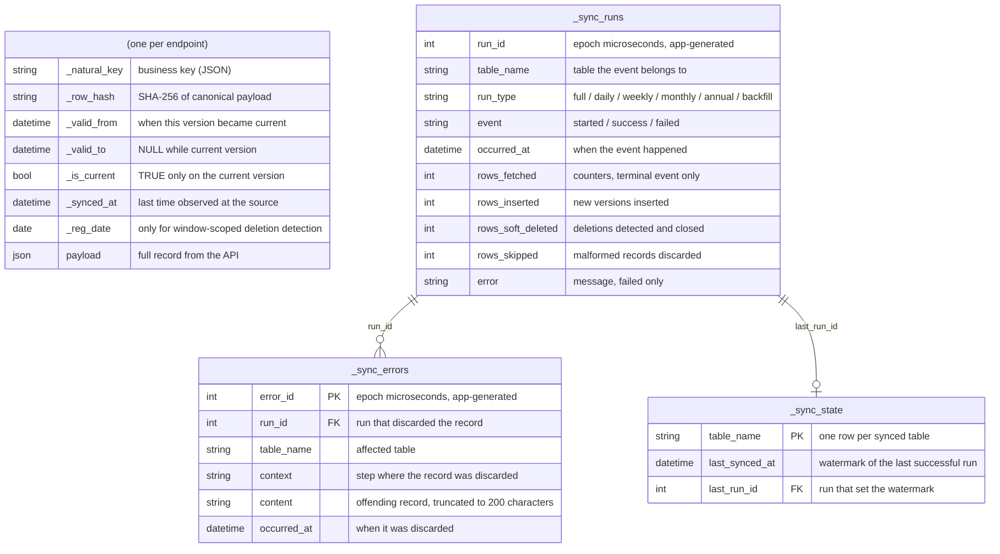
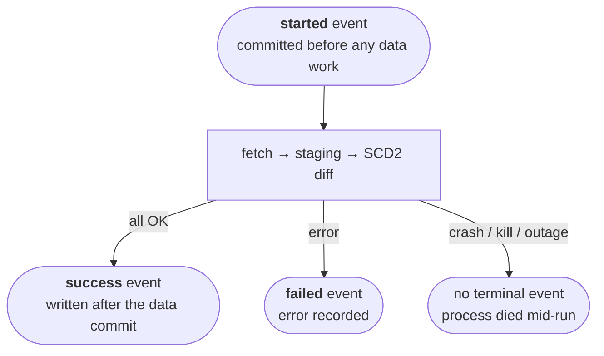

# BDNS Sync

[](https://github.com/cruzlorite/bdns-sync/actions/workflows/ci.yml)
[](https://www.gnu.org/licenses/gpl-3.0)
[](https://www.python.org/downloads/)

[🇪🇸 Spanish version](./README.md)

> The [Spanish README](./README.md) is the canonical version; this translation may occasionally lag behind it.

Sync engine that maintains a local, versioned (SCD2) copy of the [Spanish National Subsidies Database (BDNS) REST API](https://www.infosubvenciones.es/bdnstrans/api).

It builds on [`bdns-fetch`](https://github.com/cruzlorite/bdns-fetch), which implements data extraction from the API; `bdns-sync` adds the storage layer: historical versioning, change and deletion detection, and run logging.

It is a single-purpose tool: each invocation syncs one endpoint, with no configuration file. Scheduling cadence lives in [`scripts/delta_load.sh`](scripts/delta_load.sh).

## Contents

- [Requirements](#requirements)
- [Installation](#installation)
- [Usage](#usage)
- [Target databases](#target-databases)
- [Scheduled operation](#scheduled-operation)
- [Data model](#data-model)
- [Endpoint types](#endpoint-types)
- [Date windows and historical load](#date-windows-and-historical-load)
- [Official good practices](#official-good-practices)
- [Known limitations](#known-limitations)
- [Development](#development)
- [Legal notice](#legal-notice)
- [License and links](#license-and-links)

## Requirements

- Python 3.11 to 3.14
- [Poetry](https://python-poetry.org/)
- A SQLAlchemy-compatible target database (see [Target databases](#target-databases))

## Installation

```bash
git clone https://github.com/cruzlorite/bdns-sync.git
cd bdns-sync
poetry install                 # SQLite/PostgreSQL/MySQL
poetry install -E bigquery     # adds the BigQuery driver
```

BigQuery support is an optional extra (`bdns-sync[bigquery]`): it keeps the `google-cloud-*` stack out of installs that don't need it.

## Usage

The target is configured through the `BDNS_SYNC_TARGET_URL` environment variable (a SQLAlchemy URL):

```bash
export BDNS_SYNC_TARGET_URL="bigquery://project/dataset"   # or postgresql://..., sqlite:///...
```

Main commands:

```bash
bdns-sync list --kind full                                    # list full-replace entities
bdns-sync list --kind search                                  # list incremental entities
bdns-sync sync sectores                                       # sync a catalog entity
bdns-sync sync concesiones_busqueda --window daily            # incremental window sync
bdns-sync sync concesiones_busqueda --since 2020-01-01        # historical load (through yesterday)
bdns-sync sync concesiones_busqueda --since 2020-01-01 --until 2020-12-31
```

## Target databases

All sync logic uses portable SQL (correlated `EXISTS`/`NOT EXISTS` subqueries, no engine-specific `MERGE` or `UPDATE ... FROM`), so any database with a SQLAlchemy dialect works as a target. Verified:

| Target | Status | Notes |
|---|---|---|
| SQLite | Verified (full test suite) | No extra setup |
| BigQuery | Verified (live, full SCD2 cycle) | Requires the `bigquery` extra; see [docs/sinks.en.md](docs/sinks.en.md) |
| PostgreSQL / MySQL | Compatible by design (portable SQL) | Install the driver (`psycopg2`, `pymysql`, ...) |

Architecture details (the `Sink` interface, per-dialect adapters, the staging load pipeline) and BigQuery-specific setup (authentication, permissions, load jobs, clustering) are in [docs/sinks.en.md](docs/sinks.en.md).

## Scheduled operation

Continuous operation requires a single cron line. The `delta_load.sh` script decides internally which entities and windows to run each day (weekly window daily, monthly on Mondays, annual three times a year):

```
0 2 * * * BDNS_SYNC_TARGET_URL=bigquery://project/dataset /path/to/repo/scripts/delta_load.sh
```

Before starting the cron job, run the initial historical load once:

```
BDNS_SYNC_TARGET_URL=bigquery://project/dataset /path/to/repo/scripts/full_load.sh
```

The load is idempotent: re-running it does not duplicate data.

## Data model

Each synced endpoint has its own table, and all tables share the same generic schema, with no endpoint-specific fields. The original record is stored whole in `payload`; the remaining columns are SCD2 control columns:

| Column | Description |
|---|---|
| `_natural_key` | The record's business key (JSON of the key fields; see the entity tables below). Together with `_valid_from` it identifies each version |
| `_row_hash` | SHA-256 of the canonical payload; detects changes without comparing field by field. Canonicalization sorts object keys **and array elements** (recursively), because the API returns nested arrays in nondeterministic order (see [known API issues](docs/bdns-api-behavior.en.md#8-known-api-issues)) |
| `_valid_from` / `_valid_to` | Validity span of this version. `_valid_to` is `NULL` while it is the current version |
| `_is_current` | `True` on the current version of each natural key |
| `_synced_at` | Last time this version was observed at the source (updated even when nothing changed) |
| `_reg_date` | The payload's own registration date. Only populated for entities with window-scoped deletion detection; `NULL` otherwise |
| `payload` | The full record exactly as returned by the API, serialized as JSON (text column, portable across engines) |

If the API adds or removes a field, no migration is required: the change is detected via the hash and versioned like any other.



### Control tables

Shared across all endpoints, with the `_sync_` prefix:

- **`_sync_state`**: one row per table, holding the watermark: `table_name`, `last_synced_at`, `last_run_id`.
- **`_sync_runs`**: append-only **event** log, never updated in place: one `started` event when a run begins (committed immediately, outside the data transaction) and one terminal `success`/`failed` event when it ends. Columns: `run_id`, `table_name`, `run_type` (`full`, `daily`/`weekly`/`monthly`/`annual`, or `backfill`), `event`, `occurred_at`, `error`, and the counters (`rows_fetched`, `rows_inserted`, `rows_soft_deleted`, `rows_skipped`) on the terminal event.
- **`_sync_errors`**: one row per discarded malformed record: `error_id`, `run_id`, `table_name`, `context`, `content` (truncated to 200 characters), `occurred_at`. See [Known limitations](#known-limitations).

### Run lifecycle



A run's state is its **latest event**. Guarantees, per engine:

- **`success`**: the data is committed in the final table, on every engine (the event is written after the data commit, never inside it).
- **`failed` or `started` with no terminal event**: if the target engine supports transactions (e.g. SQLite, PostgreSQL), the final table is left untouched by rollback. If it does not (e.g. BigQuery, whose driver `commit()` is a verified no-op), a failure mid-diff can leave partially-applied changes; even so the design converges, because staging is cleared and rebuilt at the start of every run and re-running the same range heals any intermediate state. The operational rule is the same on every engine: **no `success` event, re-run**; the tool is idempotent.

Because the `success` event is written in its own transaction, after the data commit, there is a theoretical window where the ingest completes but the event never gets recorded. That risk is accepted because the `_sync_*` tables are purely informational: the sync logic never reads them (what gets synced, and over which range, is decided by the CLI flags), so a lost event affects neither the data already written nor future runs.

## Endpoint types

There are two families, determined by data volume.

### Full replace (`bdns-sync sync <entity>`)

Small catalogs, where fetching the complete set on every run is affordable.

| Shape | Reason | Entities |
|---|---|---|
| Simple | A single call, no parameters | `sectores`, `actividades`, `finalidades`, `beneficiarios`, `instrumentos`, `objetivos`, `convocatorias_ultimas`, `regiones` |
| Swept | The API does not return the union when the parameter is omitted; each value must be queried and the results merged into one table | `organos`/`organos_agrupacion` (sweep `idAdmon`), `reglamentos` (sweeps `ambito`), `sanciones_busqueda` |
| Discover-then-detail | The listing does not include every field | `planesestrategicos_busqueda`/`planesestrategicos`/`planesestrategicos_vigencia`, `grandesbeneficiarios_anios`/`grandesbeneficiarios_busqueda` |

### Registration-date incremental (`bdns-sync sync <entity> --window {daily,weekly,monthly,annual}`)

Endpoints with tens of millions of rows, where full replacement is not viable.

| Entity | Natural key |
|---|---|
| `concesiones_busqueda` | `id` |
| `ayudasestado_busqueda` | `idConcesion` |
| `minimis_busqueda` | `idConcesion` |
| `partidospoliticos_busqueda` | `id` |
| `convocatorias_busqueda` | `numeroConvocatoria` |
| `convocatorias` | `codigoBDNS` |

`convocatorias` is a two-step case: discovery queries the `convocatorias_busqueda` listing by date range to collect the codes registered in the window, and each discovered code is then fetched in full through the detail endpoint (`convocatorias`, by `numConv`). The detail record is what gets versioned into the `convocatorias` table; the discovery listing is also synced as its own table, `convocatorias_busqueda`, through the same incremental machinery as the rest of this section.

`convocatorias_busqueda` does **not** replace `convocatorias`: the listing carries only 10 of the ~30 detail fields (no budget, application dates, documents, instruments, etc.), and its hash staying the same says nothing about whether a detail-only field changed. Never use the listing to decide whether a code's detail fetch can be skipped.

The detail step of `convocatorias` is the expensive one: one real API call per discovered code, with no pagination possible. It is parallelized with paced request starts (8 workers, ~9.5 req/s, just under the official 10/s cap), which cuts a real month from hours to minutes with zero `429`s; figures in [section 7 of docs/bdns-api-behavior.en.md](docs/bdns-api-behavior.en.md#7-measured-performance). The same machinery ([`bdns/sync/pipeline.py`](bdns/sync/pipeline.py)) drives the detail steps of `planesestrategicos` and `planesestrategicos_vigencia`.

A record's registration date does not change when the record is edited, so re-querying the same window later finds no new additions, but does detect edits via the hash. Corrections cluster near the registration date and taper off with age; hence the window cascade: every level reaches back to yesterday (`window_bounds`), so `annual` contains `monthly` contains `weekly` contains `daily` on any given day. `scripts/delta_load.sh` runs only the widest one that applies that day (weekly daily, monthly on Mondays, annual on Jan/May/Sep 1st), never stacked: the widest already covers the narrower ones entirely, so stacking would just re-fetch and re-diff the same range twice for no extra detection.

## Date windows and historical load

Date handling against the API involves several subtleties verified live, documented in detail in [docs/bdns-api-behavior.en.md](docs/bdns-api-behavior.en.md). Summary:

- A window is a day range inclusive on both ends; the upper end is always yesterday.
- The API has two families of date parameters with **opposite** upper-bound semantics (exclusive for `fechaRegFin`, inclusive for `fechaHasta`). The conversion is centralized in `generic.to_api_upper_bound`.
- Every window is chunked into pieces of at most 7 days before being queried, for reliability and speed. The result does not depend on chunk size.
- Boundary correctness (no overlaps and no gaps between consecutive days) is verified live across all 5 entities and fixed as a permanent test.
- Four of the five incremental entities also detect real deletions, by comparing the fetched data against the table rows whose registration date falls in the same range.

The cascade windows reach at most 365 days back. For a full historical load, use `--since DATE [--until DATE]`, which runs through exactly the same machinery. The available historical depth depends on the API's retention per endpoint, from ~4 years (`concesiones_busqueda`) to ~12 (`convocatorias`); [`scripts/full_load.sh`](scripts/full_load.sh) already includes conservative per-entity start dates. See the full table in [docs/bdns-api-behavior.en.md](docs/bdns-api-behavior.en.md#6-historical-depth-per-endpoint).

### What to expect from the initial load

Durations measured on a real full bootstrap (July 2026, BigQuery target, single machine). The bottleneck is always the source API, never the target:

| Load | Rows | Duration |
|---|---|---|
| All 17 full-replace catalogs | ~150K | ~10 s most; `planesestrategicos` and `planesestrategicos_vigencia` ~4 min each (per-key detail), `grandesbeneficiarios_busqueda` ~2 min |
| `concesiones_busqueda` (since 2020) | 27.7 M | ~2.5 h |
| `ayudasestado_busqueda` (since 2015) | 6.4 M | ~2 h |
| `minimis_busqueda` (since 2015) | 4.3 M | ~30 min |
| `convocatorias_busqueda` (since 2013) | 636 K | ~6 min |
| `partidospoliticos_busqueda` (since 2020) | 6 K | ~2 min |
| `convocatorias` (since 2013) | 636 K | **~19 h** |

A full bootstrap totals around **24 hours**, dominated by `convocatorias`: every discovered code requires an individual detail call, parallelized just under the official 10 requests/second cap — pure API cost, independent of the target engine. `full_load.sh` slices the backfills into one-year pieces that commit independently, so an interruption only costs the slice in flight; re-running is always safe (idempotent). Transient API outages (timeouts, nightly maintenance) are absorbed by the client's backoff retries.

## Official good practices

The design follows the official ["Buenas prácticas API SNPSAP"](https://www.infosubvenciones.es/bdnstrans/estaticos/ayuda/Buenas%20pr%C3%A1cticas%20API%20SNPSAP.pdf) document:

- **10 requests per second per IP limit**, enforced by `bdns-fetch`.
- **Maximum page size** (10,000 records per call), and always **all pages**: bdns-fetch's `num_pages` parameter defaults to 1, silently truncating any response larger than one page (caught live: `grandesbeneficiarios_busqueda` returned 10,000 of 142,260 rows). The `generic.all_pages` wrapper forces `num_pages=0` on every paginated method, detected by signature.
- **Daily/weekly/monthly/annual cadence by registration date**, as the document recommends.
- **The `terceros` endpoint is not used**: the document itself flags it as redundant.
- **Reconciliation to detect removals**: grants are withdrawn from the BDNS 4 calendar years after being awarded. Full-catalog syncs detect removals by comparing against the entire current state; for the large incremental endpoints, where that comparison is not viable, a registration-date-scoped comparison is used instead (see [docs/bdns-api-behavior.en.md](docs/bdns-api-behavior.en.md#5-window-scoped-deletion-detection)).

## Known limitations

The source API's problematic behaviors (malformed records, `ERR_MANTENIMIENTO_BBDD`, inconsistent date semantics, and so on) are consolidated in [known API issues](docs/bdns-api-behavior.en.md#8-known-api-issues). Limitations of the tool itself:

- `organos_codigo` and `organos_codigoadmin` are not implemented (group H); see the [roadmap](docs/roadmap.en.md).
- `partidospoliticos_busqueda` has no deletion detection: its payload exposes no registration-date field (see [known API issues](docs/bdns-api-behavior.en.md#8-known-api-issues)).
- Malformed records are discarded and recorded in `_sync_errors` (context plus content truncated to 200 characters, linked by `run_id`); they are never stored in the synced tables, because without a valid natural key they cannot be versioned.

## Development

```bash
poetry install -E bigquery
poetry run bdns-sync --help
make test
```

Pending work is tracked in the [roadmap](docs/roadmap.en.md).

## Legal notice

Unofficial project, not affiliated with the Base de Datos Nacional de Subvenciones (BDNS) or Spain's Ministerio de Hacienda. Distributed under the GPL v3, which expressly disclaims any warranty: use is at your own risk, with no warranty of any kind and no liability accepted by the author for damages, data loss, or misuse.

The synced data comes from the [Sistema Nacional de Publicidad de Subvenciones y Ayudas Públicas](https://www.infosubvenciones.es) and is subject to its own [legal notice](https://www.infosubvenciones.es/bdnstrans/GE/es/avisolegal) and to the [API good-practices document](https://www.infosubvenciones.es/bdnstrans/estaticos/ayuda/Buenas%20pr%C3%A1cticas%20API%20SNPSAP.pdf).

## License and links

- [GNU GPL v3.0](./LICENSE)
- [Official API](https://www.infosubvenciones.es/bdnstrans/api) · [BDNS Portal](https://www.infosubvenciones.es) · [BDNS legal notice](https://www.infosubvenciones.es/bdnstrans/GE/es/avisolegal)
- Sibling project: [bdns-fetch](https://github.com/cruzlorite/bdns-fetch) (extraction)
