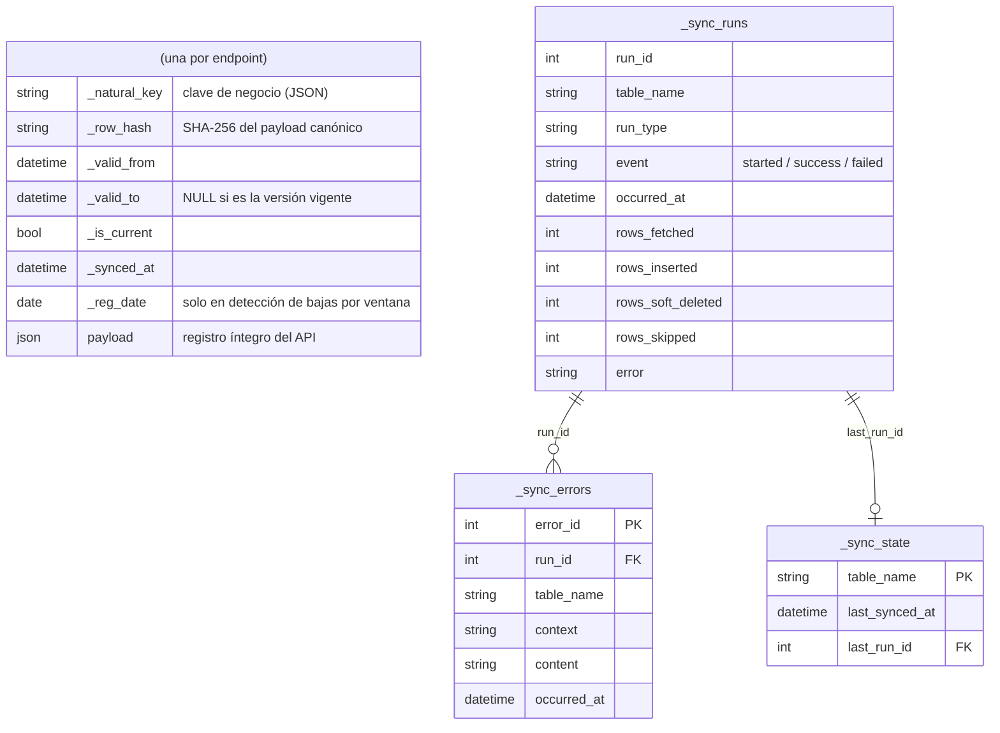
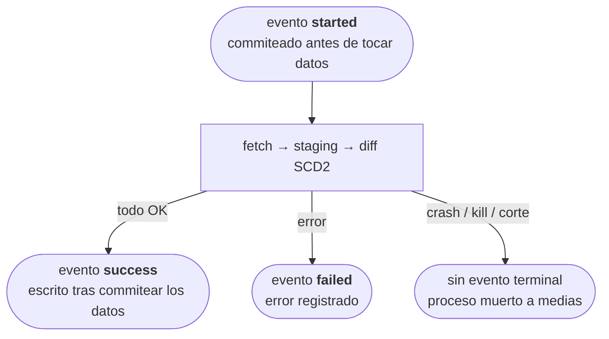

# BDNS Sync

[](https://github.com/cruzlorite/bdns-sync/actions/workflows/ci.yml)
[](https://codecov.io/gh/cruzlorite/bdns-sync)
[](https://www.gnu.org/licenses/gpl-3.0)
[](https://www.python.org/downloads/)

[🇬🇧 English version](./README.en.md)

Motor de sincronización que mantiene una copia local versionada (SCD2) de la [API REST de la Base de Datos Nacional de Subvenciones (BDNS)](https://www.infosubvenciones.es/bdnstrans/api).

Se apoya en [`bdns-fetch`](https://github.com/cruzlorite/bdns-fetch), que implementa la extracción de datos del API; `bdns-sync` añade la capa de almacenamiento: versionado histórico, detección de cambios y bajas, y registro de ejecuciones.

Es una herramienta de propósito único: cada invocación sincroniza un endpoint, sin fichero de configuración. La cadencia de ejecución vive en [`scripts/delta_load.sh`](scripts/delta_load.sh).

## Índice

- [Requisitos](#requisitos)
- [Instalación](#instalación)
- [Uso](#uso)
- [Bases de datos de destino](#bases-de-datos-de-destino)
- [Operación programada](#operación-programada)
- [Modelo de datos](#modelo-de-datos)
- [Tipos de endpoint](#tipos-de-endpoint)
- [Ventanas de fecha y carga histórica](#ventanas-de-fecha-y-carga-histórica)
- [Buenas prácticas oficiales](#buenas-prácticas-oficiales)
- [Limitaciones conocidas](#limitaciones-conocidas)
- [Desarrollo](#desarrollo)
- [Aviso legal](#aviso-legal)
- [Licencia y enlaces](#licencia-y-enlaces)

## Requisitos

- Python 3.11 a 3.14
- [Poetry](https://python-poetry.org/)
- Una base de datos compatible con SQLAlchemy como destino (ver [Bases de datos de destino](#bases-de-datos-de-destino))

## Instalación

```bash
git clone https://github.com/cruzlorite/bdns-sync.git
cd bdns-sync
poetry install                 # SQLite/PostgreSQL/MySQL
poetry install -E bigquery     # añade el driver de BigQuery
```

El soporte de BigQuery es un extra opcional (`bdns-sync[bigquery]`): mantiene la pila `google-cloud-*` fuera de las instalaciones que no la necesitan.

## Uso

El destino se configura con la variable de entorno `BDNS_SYNC_TARGET_URL` (una URL de SQLAlchemy):

```bash
export BDNS_SYNC_TARGET_URL="bigquery://proyecto/dataset"   # o postgresql://..., sqlite:///...
```

Comandos principales:

```bash
bdns-sync list --kind full                                    # lista las entidades de reemplazo completo
bdns-sync list --kind search                                  # lista las entidades incrementales
bdns-sync sync sectores                                       # sincroniza una entidad de catálogo
bdns-sync sync concesiones_busqueda --window daily            # sincronización incremental por ventana
bdns-sync sync concesiones_busqueda --since 2020-01-01        # carga histórica (hasta ayer)
bdns-sync sync concesiones_busqueda --since 2020-01-01 --until 2020-12-31
```

## Bases de datos de destino

Toda la lógica de sincronización usa SQL portable (subconsultas `EXISTS`/`NOT EXISTS` correlacionadas, sin `MERGE` ni `UPDATE ... FROM` específicos de un motor), por lo que cualquier base de datos con dialecto de SQLAlchemy sirve como destino. Verificado:

| Destino | Estado | Notas |
|---|---|---|
| SQLite | Verificado (suite de tests completa) | Sin configuración adicional |
| BigQuery | Verificado (en vivo, ciclo SCD2 completo) | Requiere el extra `bigquery`; ver más abajo |
| PostgreSQL / MySQL | Compatible por diseño (SQL portable) | Requieren instalar su driver (`psycopg2`, `pymysql`, ...) |

El almacenamiento está detrás de una interfaz `Sink` ([`bdns/sync/sinks/`](bdns/sync/sinks/)): la capa de fetch entrega lotes de registros y el sink es dueño de todo lo demás (versionado SCD2, detección de bajas, registro de ejecuciones). La implementación actual es [`SQLSink`](bdns/sync/sinks/sql/__init__.py), que cubre cualquier motor con dialecto de SQLAlchemy; las diferencias por motor se concentran en sus adaptadores internos ([`bdns/sync/sinks/sql/dialects.py`](bdns/sync/sinks/sql/dialects.py)). Un futuro destino no SQL (p. ej. Parquet) sería otra implementación de `Sink`, sin tocar la capa de fetch.

La carga del staging solapa el fetch del lote siguiente con la escritura del actual mediante un pipeline productor/consumidor genérico ([`bdns/sync/pipeline.py`](bdns/sync/pipeline.py)), con cola acotada como contrapresión. Cifras y justificación en la [sección 7 de docs/bdns-api-behavior.md](docs/bdns-api-behavior.md#7-rendimiento-medido).

### BigQuery

```bash
export BDNS_SYNC_TARGET_URL="bigquery://<proyecto>/<dataset>"
```

- **Autenticación**: credenciales por defecto de la aplicación (`gcloud auth application-default login`) o cuenta de servicio vía `GOOGLE_APPLICATION_CREDENTIALS`.
- **Permisos mínimos**: `roles/bigquery.dataEditor` sobre el dataset y `roles/bigquery.jobUser` sobre el proyecto.
- **Índices**: BigQuery no tiene índices secundarios; el adaptador los omite y en su lugar las tablas se crean con `CLUSTER BY (_natural_key, _is_current)`, las columnas por las que filtra toda la maquinaria SCD2.
- **Escritura por load jobs, no DML**: la carga del staging usa `load_table_from_json` en vez de sentencias INSERT, ~3-4x más rápido y **gratis** (los load jobs no cuentan contra la cuota de bytes de query/DML). Medido en vivo sobre el mismo backfill: ~250-325 filas/s con DML por lotes frente a ~900-1.300 filas/s con load jobs.
- **Escrituras estrictamente en serie**: BigQuery limita las operaciones de actualización por tabla a un ritmo fijo bajo; el envío concurrente de load jobs dispara `429 too many table update operations`, un límite duro de plataforma, no una cuota ampliable.
- **Sin autoincremento**: los identificadores de las tablas de control (`run_id`, `error_id`) los genera la aplicación (microsegundos de época), no la base de datos.
- El resto de diferencias (tipo JSON sin soporte de parámetros bind, `DELETE` que exige `WHERE`, literales `NULL` que requieren tipo explícito) están resueltas y documentadas en [`dialects.py`](bdns/sync/sinks/sql/dialects.py) y el código de `sinks/sql/`.

## Operación programada

Para la operación continua basta una línea de cron. El script `delta_load.sh` decide internamente qué entidades y ventanas ejecutar cada día (cadencia diaria, semanal, mensual y anual):

```
0 2 * * * BDNS_SYNC_TARGET_URL=bigquery://proyecto/dataset /ruta/al/repo/scripts/delta_load.sh
```

Antes de arrancar el cron, ejecute una única vez la carga histórica inicial:

```
BDNS_SYNC_TARGET_URL=bigquery://proyecto/dataset /ruta/al/repo/scripts/full_load.sh
```

La carga es idempotente: reejecutarla no duplica datos.

## Modelo de datos

Cada endpoint sincronizado tiene su propia tabla, y todas comparten el mismo esquema genérico, sin campos específicos por endpoint. El registro original se almacena íntegro en `payload`; el resto son columnas de control SCD2:

| Columna | Descripción |
|---|---|
| `_natural_key` | Clave de negocio del registro (JSON de los campos clave; ver las tablas de entidades más abajo). Junto con `_valid_from` identifica cada versión |
| `_row_hash` | SHA-256 del payload canónico; permite detectar cambios sin comparar campo a campo. La canonicalización ordena claves de objetos **y elementos de arrays** (recursivo), porque el API devuelve arrays anidados en orden no determinista (ver [problemas conocidos del API](docs/bdns-api-behavior.md#8-problemas-conocidos-del-api)) |
| `_valid_from` / `_valid_to` | Periodo de vigencia de esta versión. `_valid_to` es `NULL` mientras es la versión actual |
| `_is_current` | `True` en la versión vigente de cada clave natural |
| `_synced_at` | Última vez que esta versión se observó en el origen (se actualiza aunque no haya cambios) |
| `_reg_date` | Fecha de registro propia del payload. Solo se rellena en las entidades con detección de bajas por ventana; `NULL` en el resto |
| `payload` | El registro completo tal como lo devuelve el API, serializado como JSON (columna de texto, portable entre motores) |

Si el API añade o elimina un campo no se requiere migración: el cambio se detecta por hash y se versiona como cualquier otro.



### Tablas de control

Compartidas por todos los endpoints, con prefijo `_sync_`:

- **`_sync_state`**: una fila por tabla, con la marca de agua: `table_name`, `last_synced_at`, `last_run_id`.
- **`_sync_runs`**: registro de **eventos** *append-only*, nunca se actualiza en sitio: un evento `started` al arrancar (commiteado inmediatamente, fuera de la transacción de datos) y un evento terminal `success`/`failed` al acabar. Columnas: `run_id`, `table_name`, `run_type` (`full`, `daily`/`weekly`/`monthly`/`annual` o `backfill`), `event`, `occurred_at`, `error`, y los contadores (`rows_fetched`, `rows_inserted`, `rows_soft_deleted`, `rows_skipped`) en el evento terminal.
- **`_sync_errors`**: una fila por registro malformado descartado: `error_id`, `run_id`, `table_name`, `context`, `content` (truncado a 200 caracteres), `occurred_at`. Ver [Limitaciones conocidas](#limitaciones-conocidas).

### Ciclo de vida de una ejecución



El estado de una ejecución es su **último evento**. Las garantías, por motor:

- **`success`**: los datos están commiteados en la tabla final, en todos los motores (el evento se escribe después del commit de datos, nunca dentro).
- **`failed` o `started` sin terminal**: si el motor de destino soporta transacciones (p. ej. SQLite, PostgreSQL), la tabla final queda intacta por rollback. Si no las soporta (p. ej. BigQuery, cuyo `commit()` de driver es un no-op verificado en vivo), un fallo a mitad del diff puede dejar cambios parciales; aun así el diseño converge, porque el staging se vacía y reconstruye al inicio de cada ejecución y re-ejecutar el mismo rango repara cualquier estado intermedio. La regla operativa es la misma en todos los motores: **sin evento `success`, re-ejecuta**; la herramienta es idempotente.

## Tipos de endpoint

Hay dos familias, determinadas por el volumen de datos.

### Reemplazo completo (`bdns-sync sync <entidad>`)

Catálogos pequeños, donde traer el conjunto completo en cada ejecución es asumible.

| Forma | Motivo | Entidades |
|---|---|---|
| Simple | Una sola llamada, sin parámetros | `sectores`, `actividades`, `finalidades`, `beneficiarios`, `instrumentos`, `objetivos`, `convocatorias_ultimas`, `regiones` |
| Barrido | El API no devuelve la unión si se omite el parámetro; hay que consultar cada valor y fusionar los resultados en una tabla | `organos`/`organos_agrupacion` (barren `idAdmon`), `reglamentos` (barre `ambito`), `sanciones_busqueda` |
| Descubrimiento y detalle | El listado no incluye todos los campos | `planesestrategicos_busqueda`/`planesestrategicos`/`planesestrategicos_vigencia`, `grandesbeneficiarios_anios`/`grandesbeneficiarios_busqueda` |

### Incremental por fecha de registro (`bdns-sync sync <entidad> --window {daily,weekly,monthly,annual}`)

Endpoints con decenas de millones de filas, donde el reemplazo completo no es viable.

| Entidad | Clave natural |
|---|---|
| `concesiones_busqueda` | `id` |
| `ayudasestado_busqueda` | `idConcesion` |
| `minimis_busqueda` | `idConcesion` |
| `partidospoliticos_busqueda` | `id` |
| `convocatorias_busqueda` | `numeroConvocatoria` |
| `convocatorias` | `codigoBDNS` |

`convocatorias` es un caso de dos pasos: el descubrimiento consulta el listado de `convocatorias_busqueda` por rango de fechas para obtener los códigos registrados en la ventana, y cada código descubierto se solicita después completo al endpoint de detalle (`convocatorias`, por `numConv`). El registro de detalle es el que se versiona en la tabla `convocatorias`; el listado de descubrimiento se sincroniza además como su propia tabla, `convocatorias_busqueda`, con la misma máquina incremental que el resto de entidades de esta sección.

`convocatorias_busqueda` **no sustituye** a `convocatorias`: el listado trae solo 10 de los ~30 campos del detalle (sin presupuesto, fechas de solicitud, documentos, instrumentos, etc.), y que su hash no cambie no dice nada sobre si cambió un campo exclusivo del detalle. Nunca se debe usar el listado para decidir si conviene omitir la llamada de detalle de un código.

El paso de detalle de `convocatorias` es el caro: una llamada real por código descubierto, sin paginación posible. Está paralelizado con arranques de petición espaciados (8 hilos, ~9,5 peticiones/segundo, justo bajo el límite oficial de 10/s), lo que reduce un mes real de horas a minutos sin ningún `429`; cifras en la [sección 7 de docs/bdns-api-behavior.md](docs/bdns-api-behavior.md#7-rendimiento-medido). La misma maquinaria ([`bdns/sync/pipeline.py`](bdns/sync/pipeline.py)) la usan los pasos de detalle de `planesestrategicos` y `planesestrategicos_vigencia`.

La fecha de registro de un registro no cambia cuando este se edita, por lo que reconsultar la misma ventana más adelante no encuentra altas nuevas, pero sí detecta ediciones mediante el hash. Las correcciones se concentran cerca de la fecha de registro y disminuyen con la antigüedad; de ahí la cascada de ventanas: cada nivel llega hasta ayer (`window_bounds`), así que `annual` contiene a `monthly`, que contiene a `weekly`, que contiene a `daily`, el mismo día. `scripts/delta_load.sh` ejecuta solo la más ancha que toque ese día (anual el 1 de enero, mensual el día 1, semanal en domingo, diaria el resto), nunca varias apiladas: la más ancha ya cubre entera a las más estrechas, apilarlas sería re-consultar y re-diferenciar el mismo rango dos veces sin ganar detección.

## Ventanas de fecha y carga histórica

El manejo de fechas contra el API tiene varias sutilezas verificadas en vivo, documentadas en detalle en [docs/bdns-api-behavior.md](docs/bdns-api-behavior.md). Resumen:

- Una ventana es un rango de días inclusivo por ambos extremos; el extremo superior siempre es ayer.
- El API tiene dos familias de parámetros de fecha con semántica de extremo superior **opuesta** (exclusiva en `fechaRegFin`, inclusiva en `fechaHasta`). La conversión está centralizada en `generic.to_api_upper_bound`.
- Toda ventana se trocea en piezas de máximo 7 días antes de consultarse, por fiabilidad y velocidad. El resultado no depende del tamaño de trozo.
- La corrección de los límites (sin solapamientos ni huecos entre días consecutivos) está verificada en vivo en las 5 entidades y fijada como test permanente.
- Cuatro de las cinco entidades incrementales detectan además bajas reales, comparando lo obtenido contra las filas de la tabla cuya fecha de registro cae en el mismo rango.

Las ventanas en cascada llegan como máximo a 365 días atrás. Para la carga histórica completa se usa `--since DATE [--until DATE]`, que emplea exactamente la misma maquinaria. La profundidad histórica disponible depende de la retención del API por endpoint, desde ~4 años (`concesiones_busqueda`) hasta ~12 (`convocatorias`); [`scripts/full_load.sh`](scripts/full_load.sh) ya incluye fechas de inicio conservadoras por entidad. Ver la tabla completa en [docs/bdns-api-behavior.md](docs/bdns-api-behavior.md#6-profundidad-histórica-por-endpoint).

## Buenas prácticas oficiales

El diseño sigue el documento oficial ["Buenas prácticas API SNPSAP"](https://www.infosubvenciones.es/bdnstrans/estaticos/ayuda/Buenas%20pr%C3%A1cticas%20API%20SNPSAP.pdf):

- **Límite de 10 peticiones por segundo y por IP**, aplicado por `bdns-fetch`.
- **Paginación al tamaño máximo** (10.000 registros por llamada), y siempre **todas las páginas**: el parámetro `num_pages` de `bdns-fetch` tiene 1 como valor por defecto, lo que trunca silenciosamente cualquier respuesta mayor de una página (detectado en vivo: `grandesbeneficiarios_busqueda` devolvía 10.000 de 142.260 filas). El wrapper `generic.all_pages` fuerza `num_pages=0` en todo método paginado, detectado por firma.
- **Cadencia diaria/semanal/mensual/anual por fecha de registro**, tal como recomienda el documento.
- **El endpoint `terceros` no se usa**: el propio documento lo señala como redundante.
- **Reconciliación para detectar bajas**: las ayudas se retiran de la BDNS a los 4 años naturales siguientes a la concesión. Los catálogos completos detectan las bajas comparando contra todo el estado actual; en los grandes endpoints incrementales, donde esa comparación no es viable, se usa una comparación acotada por fecha de registro (ver [docs/bdns-api-behavior.md](docs/bdns-api-behavior.md#5-detección-de-bajas-acotada-por-ventana)).

## Limitaciones conocidas

Los comportamientos problemáticos del API de origen (registros malformados, `ERR_MANTENIMIENTO_BBDD`, semántica de fechas inconsistente, etc.) están consolidados en los [problemas conocidos del API](docs/bdns-api-behavior.md#8-problemas-conocidos-del-api). Limitaciones propias de la herramienta:

- `organos_codigo` y `organos_codigoadmin` no están implementados (grupo H); ver la [hoja de ruta](docs/roadmap.md).
- `partidospoliticos_busqueda` no tiene detección de bajas: su payload no expone ningún campo de fecha de registro (ver [problemas conocidos del API](docs/bdns-api-behavior.md#8-problemas-conocidos-del-api)).
- Los registros malformados se descartan y quedan en `_sync_errors` (contexto y contenido truncado a 200 caracteres, enlazados por `run_id`); nunca se almacenan en las tablas sincronizadas, porque sin clave natural válida no pueden versionarse.

## Desarrollo

```bash
poetry install -E bigquery
poetry run bdns-sync --help
make test
```

La funcionalidad pendiente está en la [hoja de ruta](docs/roadmap.md).

## Aviso legal

Proyecto no oficial, sin afiliación con la Base de Datos Nacional de Subvenciones (BDNS) ni con el Ministerio de Hacienda. Se distribuye bajo licencia GPL v3, que excluye expresamente cualquier garantía: el uso es bajo responsabilidad del usuario, sin garantía de ningún tipo y sin que el autor asuma responsabilidad alguna por daños, pérdidas de datos o usos indebidos.

Los datos sincronizados proceden del [Sistema Nacional de Publicidad de Subvenciones y Ayudas Públicas](https://www.infosubvenciones.es) y están sujetos a su propio [aviso legal](https://www.infosubvenciones.es/bdnstrans/GE/es/avisolegal) y a las [buenas prácticas del API](https://www.infosubvenciones.es/bdnstrans/estaticos/ayuda/Buenas%20pr%C3%A1cticas%20API%20SNPSAP.pdf).

## Licencia y enlaces

- [GNU GPL v3.0](./LICENSE)
- [API oficial](https://www.infosubvenciones.es/bdnstrans/api) · [Portal BDNS](https://www.infosubvenciones.es) · [Aviso legal BDNS](https://www.infosubvenciones.es/bdnstrans/GE/es/avisolegal)
- Proyecto hermano: [bdns-fetch](https://github.com/cruzlorite/bdns-fetch) (extracción)
