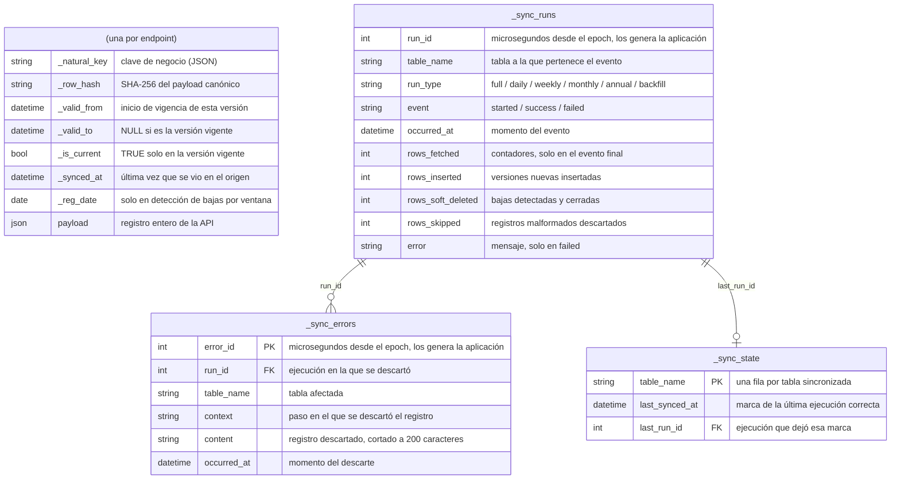
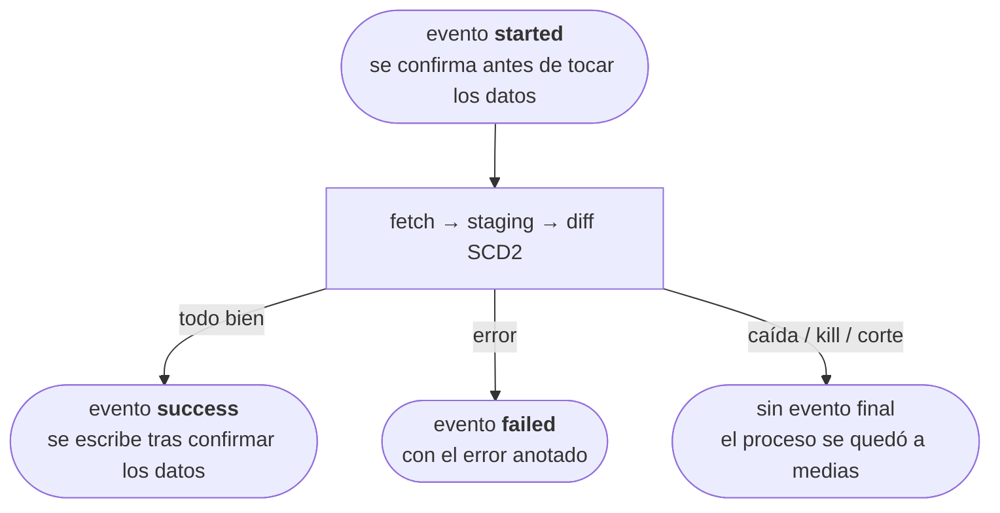

# BDNS Sync

[](https://github.com/cruzlorite/bdns-sync/actions/workflows/ci.yml)
[](https://www.gnu.org/licenses/gpl-3.0)
[](https://www.python.org/downloads/)

[🇬🇧 English version](./README.en.md)

Motor de sincronización que mantiene una copia local versionada (SCD2) de la [API REST de la Base de Datos Nacional de Subvenciones (BDNS)](https://www.infosubvenciones.es/bdnstrans/api).

Se apoya en [`bdns-fetch`](https://github.com/cruzlorite/bdns-fetch), que se encarga de extraer los datos de la API; `bdns-sync` pone encima la capa de almacenamiento: histórico versionado, detección de cambios y de bajas, y registro de ejecuciones.

La herramienta hace una sola cosa: cada invocación sincroniza un endpoint y no hay fichero de configuración. La cadencia de ejecución se define en [`scripts/delta_load.sh`](scripts/delta_load.sh).

## Índice

- [Requisitos](#requisitos)
- [Instalación](#instalación)
- [Uso](#uso)
- [Bases de datos de destino](#bases-de-datos-de-destino)
- [Operación programada](#operación-programada)
- [Modelo de datos](#modelo-de-datos)
- [Tipos de endpoint](#tipos-de-endpoint)
- [Ventanas de fecha y carga histórica](#ventanas-de-fecha-y-carga-histórica)
- [Buenas prácticas oficiales](#buenas-prácticas-oficiales)
- [Limitaciones conocidas](#limitaciones-conocidas)
- [Desarrollo](#desarrollo)
- [Aviso legal](#aviso-legal)
- [Licencia y enlaces](#licencia-y-enlaces)

## Requisitos

- Python 3.11 a 3.14
- [Poetry](https://python-poetry.org/)
- Una base de datos con dialecto de SQLAlchemy como destino (ver [Bases de datos de destino](#bases-de-datos-de-destino))

## Instalación

```bash
git clone https://github.com/cruzlorite/bdns-sync.git
cd bdns-sync
poetry install                 # SQLite/PostgreSQL/MySQL
poetry install -E bigquery     # añade el driver de BigQuery
```

El soporte de BigQuery va en un extra opcional (`bdns-sync[bigquery]`), para no arrastrar la pila `google-cloud-*` en instalaciones que no la necesitan.

## Uso

El destino se indica en la variable de entorno `BDNS_SYNC_TARGET_URL` (una URL de SQLAlchemy):

```bash
export BDNS_SYNC_TARGET_URL="bigquery://proyecto/dataset"   # o postgresql://..., sqlite:///...
```

Comandos principales:

```bash
bdns-sync list --kind full                                    # lista las entidades de reemplazo completo
bdns-sync list --kind search                                  # lista las entidades incrementales
bdns-sync sync sectores                                       # sincroniza una entidad de catálogo
bdns-sync sync concesiones_busqueda --window daily            # sincronización incremental por ventana
bdns-sync sync concesiones_busqueda --since 2020-01-01        # carga histórica (hasta ayer)
bdns-sync sync concesiones_busqueda --since 2020-01-01 --until 2020-12-31
```

## Bases de datos de destino

Toda la lógica de sincronización se escribe en SQL portable (subconsultas `EXISTS`/`NOT EXISTS` correlacionadas, sin `MERGE` ni `UPDATE ... FROM` propios de un motor concreto), así que sirve como destino cualquier base de datos con dialecto de SQLAlchemy. Lo comprobado hasta ahora:

| Destino | Estado | Notas |
|---|---|---|
| SQLite | Comprobado (suite de tests completa) | Sin configuración adicional |
| BigQuery | Comprobado contra el servicio real (ciclo SCD2 completo) | Requiere el extra `bigquery`; ver [docs/sinks.md](docs/sinks.md) |
| PostgreSQL / MySQL | Compatibles por diseño (SQL portable) | Hay que instalar su driver (`psycopg2`, `pymysql`, ...) |

Los detalles de arquitectura (interfaz `Sink`, adaptadores por dialecto, pipeline de carga) y la configuración propia de BigQuery (autenticación, permisos, load jobs, clustering) están en [docs/sinks.md](docs/sinks.md).

## Operación programada

Para el día a día basta con una línea de cron. El propio `delta_load.sh` decide qué entidades y qué ventanas toca ejecutar cada día (la semanal a diario, la mensual los lunes, la anual tres veces al año):

```
0 2 * * * BDNS_SYNC_TARGET_URL=bigquery://proyecto/dataset /ruta/al/repo/scripts/delta_load.sh
```

Antes de programar el cron hay que lanzar una sola vez la carga histórica inicial:

```
BDNS_SYNC_TARGET_URL=bigquery://proyecto/dataset /ruta/al/repo/scripts/full_load.sh
```

La carga es idempotente: repetirla no duplica datos.

Para quien no quiera mantener una máquina propia hay una imagen de contenedor publicada (`ghcr.io/cruzlorite/bdns-sync`, con el extra de BigQuery y los scripts dentro) y una receta de despliegue con job programado en la nube: ver [docs/deployment.md](docs/deployment.md).

## Modelo de datos

Cada endpoint sincronizado tiene su propia tabla, y todas comparten el mismo esquema genérico, sin campos específicos de cada endpoint. El registro original se guarda entero en `payload`; el resto son columnas de control SCD2:

| Columna | Descripción |
|---|---|
| `_natural_key` | Clave de negocio del registro (los campos clave, en JSON; ver las tablas de entidades más abajo). Junto con `_valid_from` identifica cada versión |
| `_row_hash` | SHA-256 del payload canónico; sirve para detectar cambios sin comparar campo a campo. Al canonicalizar se ordenan las claves de los objetos **y los elementos de los arrays** (de forma recursiva), porque la API devuelve los arrays anidados en un orden que cambia entre llamadas (ver [problemas conocidos de la API](docs/bdns-api-behavior.md#8-problemas-conocidos-de-la-api)) |
| `_valid_from` / `_valid_to` | Periodo de vigencia de esta versión. `_valid_to` vale `NULL` mientras es la versión actual |
| `_is_current` | `True` en la versión vigente de cada clave natural |
| `_synced_at` | Última vez que se vio esta versión en el origen (se actualiza aunque no haya cambios) |
| `_reg_date` | Fecha de registro que trae el propio payload. Solo se rellena en las entidades con detección de bajas por ventana; en el resto queda a `NULL` |
| `payload` | El registro completo tal como lo devuelve la API, serializado en JSON (columna de texto, portable entre motores) |

Si la API añade o quita un campo no hace falta migrar nada: el cambio se detecta por el hash y se versiona como cualquier otro.


```mermaid
erDiagram
    "<entidad> (una por endpoint)" {
        string  _natural_key   "clave de negocio (JSON)"
        string  _row_hash      "SHA-256 del payload canónico"
        datetime _valid_from   "inicio de vigencia de esta versión"
        datetime _valid_to     "NULL si es la versión vigente"
        bool    _is_current    "TRUE solo en la versión vigente"
        datetime _synced_at    "última vez que se vio en el origen"
        date    _reg_date      "solo en detección de bajas por ventana"
        json    payload        "registro entero de la API"
    }
    _sync_state {
        string   table_name PK "una fila por tabla sincronizada"
        datetime last_synced_at "marca de la última ejecución correcta"
        int      last_run_id FK "ejecución que dejó esa marca"
    }
    _sync_runs {
        int      run_id        "microsegundos desde el epoch, los genera la aplicación"
        string   table_name    "tabla a la que pertenece el evento"
        string   run_type      "full / daily / weekly / monthly / annual / backfill"
        string   event         "started / success / failed"
        datetime occurred_at   "momento del evento"
        int      rows_fetched  "contadores, solo en el evento final"
        int      rows_inserted "versiones nuevas insertadas"
        int      rows_soft_deleted "bajas detectadas y cerradas"
        int      rows_skipped  "registros malformados descartados"
        string   error         "mensaje, solo en failed"
    }
    _sync_errors {
        int      error_id PK   "microsegundos desde el epoch, los genera la aplicación"
        int      run_id FK     "ejecución en la que se descartó"
        string   table_name    "tabla afectada"
        string   context       "paso en el que se descartó el registro"
        string   content       "registro descartado, cortado a 200 caracteres"
        datetime occurred_at   "momento del descarte"
    }
    _sync_runs ||--o{ _sync_errors : "run_id"
    _sync_runs ||--o| _sync_state : "last_run_id"
```

### Tablas de control

Las comparten todos los endpoints y llevan el prefijo `_sync_`:

- **`_sync_state`**: una fila por tabla, con la marca de la última sincronización: `table_name`, `last_synced_at`, `last_run_id`.
- **`_sync_runs`**: un registro de **eventos** que solo crece, nunca se actualiza una fila ya escrita: un evento `started` al arrancar (confirmado de inmediato, fuera de la transacción de los datos) y un evento final `success`/`failed` al terminar. Columnas: `run_id`, `table_name`, `run_type` (`full`, `daily`/`weekly`/`monthly`/`annual` o `backfill`), `event`, `occurred_at`, `error`, y los contadores (`rows_fetched`, `rows_inserted`, `rows_soft_deleted`, `rows_skipped`) en el evento final.
- **`_sync_errors`**: una fila por cada registro malformado que se descarta: `error_id`, `run_id`, `table_name`, `context`, `content` (cortado a 200 caracteres), `occurred_at`. Ver [Limitaciones conocidas](#limitaciones-conocidas).

### Ciclo de vida de una ejecución


```mermaid
flowchart TD
    A(["evento <b>started</b><br/>se confirma antes de tocar los datos"]) --> B["fetch → staging → diff SCD2"]
    B -->|todo bien| C(["evento <b>success</b><br/>se escribe tras confirmar los datos"])
    B -->|error| D(["evento <b>failed</b><br/>con el error anotado"])
    B -->|caída / kill / corte| E(["sin evento final<br/>el proceso se quedó a medias"])
```

El estado de una ejecución es su **último evento**. Las garantías, según el motor:

- **`success`**: los datos ya están confirmados en la tabla final, sea cual sea el motor (el evento se escribe después del commit de los datos, nunca dentro de él).
- **`failed`, o `started` sin evento final**: si el motor de destino soporta transacciones (SQLite o PostgreSQL, por ejemplo), el rollback deja la tabla final intacta. Si no las soporta (BigQuery, por ejemplo, donde el `commit()` del driver no hace nada, comprobado contra el servicio real), un fallo a mitad del diff puede dejar cambios a medias; aun así el diseño converge, porque el staging se vacía y se reconstruye al principio de cada ejecución y repetir el mismo rango repara cualquier estado intermedio. La regla de operación es la misma en todos los motores: **si no hay evento `success`, se vuelve a lanzar**; la herramienta es idempotente.

Como el evento `success` se escribe en su propia transacción, después del commit de los datos, hay una ventana teórica en la que la carga termina bien pero el evento no llega a anotarse. Se asume ese riesgo porque las tablas `_sync_*` son solo informativas: la lógica de sincronización nunca las lee (qué se sincroniza y con qué rango lo deciden los flags de la CLI), así que perder un evento no afecta ni a los datos ya escritos ni a las ejecuciones siguientes.

## Tipos de endpoint

Hay dos familias, según el volumen de datos.

### Reemplazo completo (`bdns-sync sync <entidad>`)

Catálogos pequeños, donde traer el conjunto entero en cada ejecución sale barato.

| Forma | Motivo | Entidades |
|---|---|---|
| Simple | Una sola llamada, sin parámetros | `sectores`, `actividades`, `finalidades`, `beneficiarios`, `instrumentos`, `objetivos`, `convocatorias_ultimas`, `regiones` |
| Barrido | La API no devuelve la unión si se omite el parámetro: hay que consultar valor por valor y juntar los resultados en una tabla | `organos`/`organos_agrupacion` (barren `idAdmon`), `reglamentos` (barre `ambito`), `sanciones_busqueda` |
| Descubrimiento y detalle | El listado no trae todos los campos | `planesestrategicos_busqueda`/`planesestrategicos`/`planesestrategicos_vigencia`, `grandesbeneficiarios_anios`/`grandesbeneficiarios_busqueda` |

### Incremental por fecha de registro (`bdns-sync sync <entidad> --window {daily,weekly,monthly,annual}`)

Endpoints con decenas de millones de filas, donde el reemplazo completo no es viable.

| Entidad | Clave natural |
|---|---|
| `concesiones_busqueda` | `id` |
| `ayudasestado_busqueda` | `idConcesion` |
| `minimis_busqueda` | `idConcesion` |
| `partidospoliticos_busqueda` | `id` |
| `convocatorias_busqueda` | `numeroConvocatoria` |
| `convocatorias` | `codigoBDNS` |

`convocatorias` va en dos pasos: el descubrimiento consulta el listado de `convocatorias_busqueda` por rango de fechas para sacar los códigos registrados en la ventana, y de cada código se pide después el registro completo al endpoint de detalle (`convocatorias`, por `numConv`). Lo que se versiona en la tabla `convocatorias` es el registro de detalle; el listado de descubrimiento se sincroniza además por su cuenta, en la tabla `convocatorias_busqueda`, con la misma maquinaria incremental que el resto de entidades de esta sección.

`convocatorias_busqueda` **no sustituye** a `convocatorias`: el listado trae solo 10 de los ~30 campos del detalle (se queda fuera el presupuesto, las fechas de solicitud, los documentos, los instrumentos...), y que su hash no cambie no dice nada sobre si cambió algún campo que solo existe en el detalle. Nunca hay que usar el listado para decidir si se puede ahorrar la llamada de detalle de un código.

El paso de detalle de `convocatorias` es el caro: una llamada real por cada código descubierto, sin paginación posible. Va paralelizado espaciando los arranques de petición (8 hilos, ~9,5 peticiones por segundo, justo por debajo del límite oficial de 10/s), lo que baja un mes real de horas a minutos sin un solo `429`; las cifras están en la [sección 7 de docs/bdns-api-behavior.md](docs/bdns-api-behavior.md#7-rendimiento-medido). Los pasos de detalle de `planesestrategicos` y `planesestrategicos_vigencia` usan esa misma maquinaria ([`bdns/sync/pipeline.py`](bdns/sync/pipeline.py)).

La fecha de registro no cambia cuando el registro se edita más tarde, así que volver a consultar la misma ventana no descubre altas nuevas, pero sí detecta ediciones a través del hash. Las correcciones se concentran cerca de la fecha de registro y se van espaciando con el tiempo; de ahí la cascada de ventanas: cada nivel llega hasta ayer (`window_bounds`), así que el mismo día `annual` contiene a `monthly`, `monthly` a `weekly` y `weekly` a `daily`. `scripts/delta_load.sh` lanza solo la más ancha que toque ese día (la semanal a diario, la mensual los lunes, la anual el 1 de enero, de mayo y de septiembre), nunca varias apiladas: la más ancha ya cubre entera a las más estrechas, y apilarlas sería consultar y comparar dos veces el mismo rango sin detectar nada nuevo.

## Ventanas de fecha y carga histórica

El manejo de fechas contra la API tiene varias sutilezas, todas comprobadas contra el servicio real y explicadas al detalle en [docs/bdns-api-behavior.md](docs/bdns-api-behavior.md). En resumen:

- Una ventana es un rango de días cerrado por los dos extremos; el extremo superior siempre es ayer.
- La API tiene dos familias de parámetros de fecha cuyo extremo superior se comporta justo **al revés** (exclusivo en `fechaRegFin`, inclusivo en `fechaHasta`). La conversión está centralizada en `generic.to_api_upper_bound`.
- Toda ventana se parte en tramos de 7 días como máximo antes de consultarse, por fiabilidad y por velocidad. El resultado no depende del tamaño del tramo.
- Que los límites son correctos, sin solapamientos ni huecos entre días consecutivos, está comprobado contra el servicio real en las 5 entidades y fijado como test permanente.
- Cuatro de las cinco entidades incrementales detectan además bajas reales: comparan lo que devuelve la API con las filas de la tabla cuya fecha de registro cae en el mismo rango.

Las ventanas en cascada llegan como mucho a 365 días atrás. Para la carga histórica completa está `--since DATE [--until DATE]`, que usa exactamente la misma maquinaria. Hasta dónde se puede llegar depende de la retención de la API en cada endpoint, entre ~4 años (`concesiones_busqueda`) y ~12 (`convocatorias`); [`scripts/full_load.sh`](scripts/full_load.sh) ya trae fechas de inicio conservadoras para cada entidad. La tabla completa está en [docs/bdns-api-behavior.md](docs/bdns-api-behavior.md#6-profundidad-histórica-por-endpoint).

### Qué esperar de la carga inicial

Duraciones medidas en una carga inicial completa real (julio de 2026, destino BigQuery, una sola máquina). El cuello de botella es siempre la API de origen, nunca el destino:

| Carga | Filas | Duración |
|---|---|---|
| Los 17 catálogos de reemplazo completo | ~150.000 | ~10 s la mayoría; `planesestrategicos` y `planesestrategicos_vigencia`, ~4 min cada uno (detalle por clave); `grandesbeneficiarios_busqueda`, ~2 min |
| `concesiones_busqueda` (desde 2020) | 27,7 M | ~2,5 h |
| `ayudasestado_busqueda` (desde 2015) | 6,4 M | ~2 h |
| `minimis_busqueda` (desde 2015) | 4,3 M | ~30 min |
| `convocatorias_busqueda` (desde 2013) | 636 K | ~6 min |
| `partidospoliticos_busqueda` (desde 2020) | 6 K | ~2 min |
| `convocatorias` (desde 2013) | 636 K | **~19 h** |

En total, una carga inicial completa ronda las **24 horas**, y se la lleva casi entera `convocatorias`: cada código descubierto exige su propia llamada de detalle, paralelizada justo por debajo del límite oficial de 10 peticiones por segundo. Es coste de API puro, no depende del motor de destino. `full_load.sh` parte las cargas históricas en tramos de un año que se confirman por separado, así que una interrupción solo cuesta el tramo en curso; repetir es siempre seguro, porque el proceso es idempotente. Los cortes puntuales de la API (timeouts, mantenimiento nocturno) los absorben los reintentos con backoff del cliente.

## Buenas prácticas oficiales

El diseño sigue el documento oficial ["Buenas prácticas API SNPSAP"](https://www.infosubvenciones.es/bdnstrans/estaticos/ayuda/Buenas%20pr%C3%A1cticas%20API%20SNPSAP.pdf):

- **Límite de 10 peticiones por segundo y por IP**, que aplica `bdns-fetch`.
- **Paginación al tamaño máximo** (10.000 registros por llamada) y siempre **todas las páginas**: el parámetro `num_pages` de `bdns-fetch` vale 1 por defecto, lo que corta en silencio cualquier respuesta de más de una página (visto en real: `grandesbeneficiarios_busqueda` devolvía 10.000 filas de 142.260). El envoltorio `generic.all_pages` fuerza `num_pages=0` en todo método paginado, que reconoce por la firma.
- **Cadencia diaria/semanal/mensual/anual por fecha de registro**, tal como recomienda el documento.
- **El endpoint `terceros` no se usa**: el propio documento lo da por redundante.
- **Reconciliación para detectar bajas**: las ayudas se retiran de la BDNS a los 4 años naturales siguientes a la concesión. Los catálogos completos detectan las bajas comparando contra todo el estado actual; en los endpoints incrementales grandes, donde esa comparación no sale a cuenta, se compara solo dentro del rango de fechas de registro (ver [docs/bdns-api-behavior.md](docs/bdns-api-behavior.md#5-detección-de-bajas-acotada-por-ventana)).

## Limitaciones conocidas

Los comportamientos problemáticos de la API de origen (registros malformados, `ERR_MANTENIMIENTO_BBDD`, fechas con semántica inconsistente, etc.) están recogidos en los [problemas conocidos de la API](docs/bdns-api-behavior.md#8-problemas-conocidos-de-la-api). Las limitaciones de la propia herramienta son estas:

- `organos_codigo` y `organos_codigoadmin` no están implementados (grupo H); ver la [hoja de ruta](docs/roadmap.md).
- `partidospoliticos_busqueda` no tiene detección de bajas: su payload no trae ningún campo de fecha de registro (ver [problemas conocidos de la API](docs/bdns-api-behavior.md#8-problemas-conocidos-de-la-api)).
- Los registros malformados se descartan y quedan anotados en `_sync_errors` (con el contexto y el contenido cortado a 200 caracteres, enlazados por `run_id`); nunca llegan a las tablas sincronizadas, porque sin una clave natural válida no se pueden versionar.

## Desarrollo

```bash
poetry install -E bigquery
poetry run bdns-sync --help
make test
```

Lo que queda por hacer está en la [hoja de ruta](docs/roadmap.md).

## Aviso legal

Proyecto no oficial, sin ninguna relación con la Base de Datos Nacional de Subvenciones (BDNS) ni con el Ministerio de Hacienda. Se distribuye bajo licencia GPL v3, que excluye expresamente cualquier garantía: se usa bajo la responsabilidad de quien lo usa, sin garantía de ningún tipo y sin que el autor responda por daños, pérdidas de datos o usos indebidos.

Los datos sincronizados proceden del [Sistema Nacional de Publicidad de Subvenciones y Ayudas Públicas](https://www.infosubvenciones.es) y están sujetos a su propio [aviso legal](https://www.infosubvenciones.es/bdnstrans/GE/es/avisolegal) y a las [buenas prácticas de la API](https://www.infosubvenciones.es/bdnstrans/estaticos/ayuda/Buenas%20pr%C3%A1cticas%20API%20SNPSAP.pdf).

## Licencia y enlaces

- [GNU GPL v3.0](./LICENSE)
- [API oficial](https://www.infosubvenciones.es/bdnstrans/api) · [Portal BDNS](https://www.infosubvenciones.es) · [Aviso legal BDNS](https://www.infosubvenciones.es/bdnstrans/GE/es/avisolegal)
- Proyecto hermano: [bdns-fetch](https://github.com/cruzlorite/bdns-fetch) (extracción)
