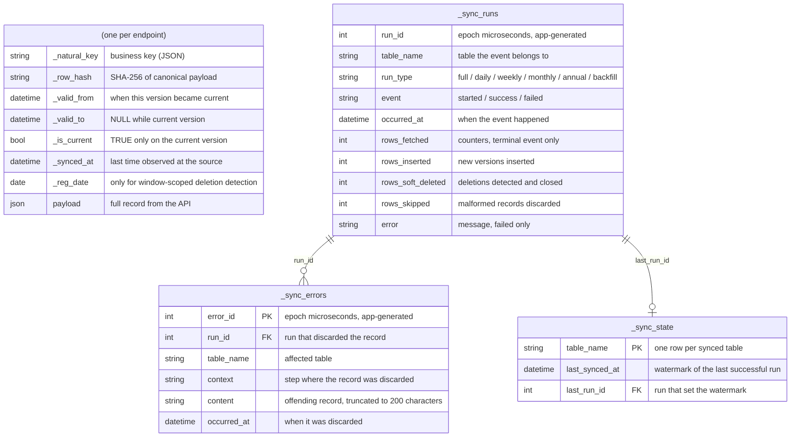
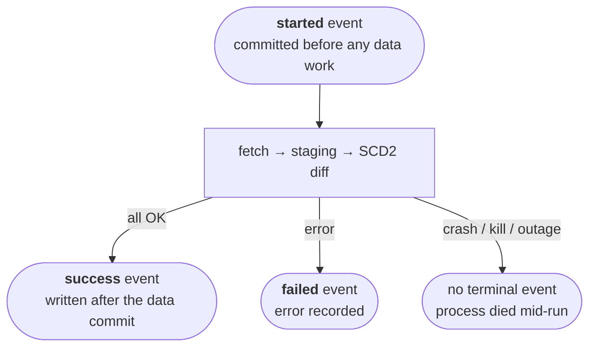

# Data model

The schema `bdns-sync` creates in the target: one table per endpoint, plus
three shared control tables.

Each synced endpoint has its own table, and all tables share the same generic schema, with no endpoint-specific fields. The original record is stored whole in `payload`; the remaining columns are SCD2 control columns:

| Column | Description |
|---|---|
| `_natural_key` | The record's business key (JSON of the key fields). Together with `_valid_from` it identifies each version |
| `_row_hash` | SHA-256 of the canonical payload; detects changes without comparing field by field. Canonicalization sorts object keys **and array elements** (recursively), because the API returns nested arrays in nondeterministic order (see [known API issues](../explanation/bdns-api-behavior.md#api-issues)) |
| `_valid_from` / `_valid_to` | Validity span of this version. `_valid_to` is `NULL` while it is the current version |
| `_is_current` | `True` on the current version of each natural key |
| `_synced_at` | Last time this version was observed at the source (updated even when nothing changed) |
| `_reg_date` | The payload's own registration date. Only populated for entities with window-scoped deletion detection; `NULL` otherwise |
| `payload` | The full record exactly as returned by the API, serialized as JSON (text column, portable across engines) |

If the API adds or removes a field, no migration is required: the change is detected via the hash and versioned like any other.

## Control tables

Shared across all endpoints, with the `_sync_` prefix:

- **`_sync_state`**: one row per table, holding the watermark: `table_name`, `last_synced_at`, `last_run_id`.
- **`_sync_runs`**: append-only **event** log, never updated in place: one `started` event when a run begins (committed immediately, outside the data transaction) and one terminal `success`/`failed` event when it ends. Columns: `run_id`, `table_name`, `run_type` (`full`, `daily`/`weekly`/`monthly`/`annual`, or `backfill`), `event`, `occurred_at`, `error`, and the counters (`rows_fetched`, `rows_inserted`, `rows_soft_deleted`, `rows_skipped`) on the terminal event.
- **`_sync_errors`**: one row per discarded malformed record: `error_id`, `run_id`, `table_name`, `context`, `content` (truncated to 200 characters), `occurred_at`. See [before querying the data](../explanation/data-caveats.md).

## Run lifecycle

A run's state is its **latest event**. Guarantees, per engine:

- **`success`**: the data is committed in the final table, on every engine (the event is written after the data commit, never inside it).
- **`failed` or `started` with no terminal event**: if the target engine supports transactions (e.g. SQLite, PostgreSQL), the final table is left untouched by rollback. If it does not (e.g. BigQuery, whose driver `commit()` is a verified no-op), a failure mid-diff can leave partially-applied changes; even so the design converges, because staging is cleared and rebuilt at the start of every run and re-running the same range heals any intermediate state. The operational rule is the same on every engine: **no `success` event, re-run**; the tool is idempotent.

Because the `success` event is written in its own transaction, after the data commit, there is a theoretical window where the ingest completes but the event never gets recorded. That risk is accepted because the `_sync_*` tables are purely informational: the sync logic never reads them (what gets synced, and over which range, is decided by the CLI flags), so a lost event affects neither the data already written nor future runs.
