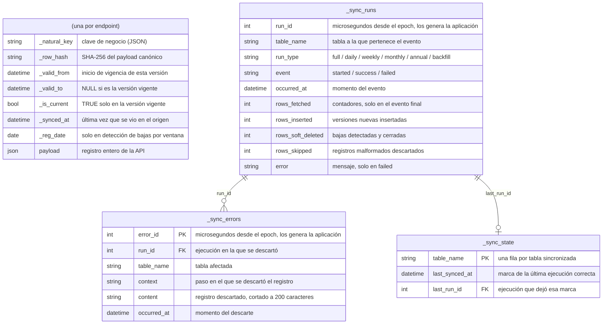
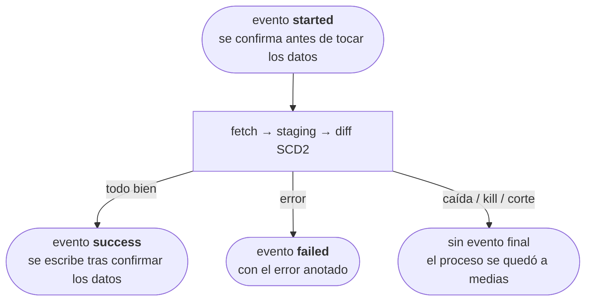

# Modelo de datos

El esquema que `bdns-sync` crea en el destino: una tabla por endpoint, más
tres tablas de control compartidas.

Cada endpoint sincronizado tiene su propia tabla, y todas comparten el mismo esquema genérico, sin campos específicos de cada endpoint. El registro original se guarda entero en `payload`; el resto son columnas de control SCD2:

| Columna | Descripción |
|---|---|
| `_natural_key` | Clave de negocio del registro (los campos clave, en JSON). Junto con `_valid_from` identifica cada versión |
| `_row_hash` | SHA-256 del payload canónico; sirve para detectar cambios sin comparar campo a campo. Al canonicalizar se ordenan las claves de los objetos **y los elementos de los arrays** (de forma recursiva), porque la API devuelve los arrays anidados en un orden que cambia entre llamadas (ver [problemas conocidos de la API](../explanation/bdns-api-behavior.md#api-issues)) |
| `_valid_from` / `_valid_to` | Periodo de vigencia de esta versión. `_valid_to` vale `NULL` mientras es la versión actual |
| `_is_current` | `True` en la versión vigente de cada clave natural |
| `_synced_at` | Última vez que se vio esta versión en el origen (se actualiza aunque no haya cambios) |
| `_reg_date` | Fecha de registro que trae el propio payload. Solo se rellena en las entidades con detección de bajas por ventana; en el resto queda a `NULL` |
| `payload` | El registro completo tal como lo devuelve la API, serializado en JSON (columna de texto, portable entre motores) |

Si la API añade o quita un campo no hace falta migrar nada: el cambio se detecta por el hash y se versiona como cualquier otro.

## Tablas de control

Las comparten todos los endpoints y llevan el prefijo `_sync_`:

- **`_sync_state`**: una fila por tabla, con la marca de la última sincronización: `table_name`, `last_synced_at`, `last_run_id`.
- **`_sync_runs`**: un registro de **eventos** que solo crece, nunca se actualiza una fila ya escrita: un evento `started` al arrancar (confirmado de inmediato, fuera de la transacción de los datos) y un evento final `success`/`failed` al terminar. Columnas: `run_id`, `table_name`, `run_type` (`full`, `daily`/`weekly`/`monthly`/`annual` o `backfill`), `event`, `occurred_at`, `error`, y los contadores (`rows_fetched`, `rows_inserted`, `rows_soft_deleted`, `rows_skipped`) en el evento final.
- **`_sync_errors`**: una fila por cada registro malformado que se descarta: `error_id`, `run_id`, `table_name`, `context`, `content` (cortado a 200 caracteres), `occurred_at`. Ver [antes de consultar los datos](../explanation/data-caveats.md).

## Ciclo de vida de una ejecución

El estado de una ejecución es su **último evento**. Las garantías, según el motor:

- **`success`**: los datos ya están confirmados en la tabla final, sea cual sea el motor (el evento se escribe después del commit de los datos, nunca dentro de él).
- **`failed`, o `started` sin evento final**: si el motor de destino soporta transacciones (SQLite o PostgreSQL, por ejemplo), el rollback deja la tabla final intacta. Si no las soporta (BigQuery, por ejemplo, donde el `commit()` del driver no hace nada, comprobado contra el servicio real), un fallo a mitad del diff puede dejar cambios a medias; aun así el diseño converge, porque el staging se vacía y se reconstruye al principio de cada ejecución y repetir el mismo rango repara cualquier estado intermedio. La regla de operación es la misma en todos los motores: **si no hay evento `success`, se vuelve a lanzar**; la herramienta es idempotente.

Como el evento `success` se escribe en su propia transacción, después del commit de los datos, hay una ventana teórica en la que la carga termina bien pero el evento no llega a anotarse. Se asume ese riesgo porque las tablas `_sync_*` son solo informativas: la lógica de sincronización nunca las lee (qué se sincroniza y con qué rango lo deciden los flags de la CLI), así que perder un evento no afecta ni a los datos ya escritos ni a las ejecuciones siguientes.
